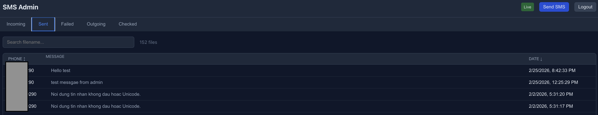

# SMS Gateway for smstools

A **web GUI and HTTP API gateway** for [smstools](http://smstools3.kekekasvi.com/) — the Linux SMS server that uses USB/serial modems.

Browse SMS folders, send messages, and monitor delivery in real-time through a modern web interface. Built with **FastAPI + Svelte**, deployed securely via **Cloudflare Tunnel**.

## Screenshots



## Features

### Web GUI (Admin Dashboard)
- **SMS File Browser** — View all smstools folders: incoming, sent, failed, outgoing, checked
- **Phone & Message Preview** — Parsed from smstools file headers (From:/To:)
- **Real-time Monitoring** — WebSocket-powered live updates when files arrive/move
- **Send Test SMS** — Compose and send SMS directly from the dashboard
- **Search & Sort** — Filter by filename, sort by name/date
- **Mobile Responsive** — Optimized layout for phone screens
- **JWT Authentication** — Secure admin access

### HTTP API
- **Send SMS** — `POST /send-sms` with MD5 signature verification
- **smstools Compatible** — Writes to `/var/spool/sms/outgoing/`, smsd handles delivery

### Infrastructure
- **Cloudflare Tunnel** — Zero-trust deployment, no public ports
- **CI/CD** — Auto-deploy on push via GitHub Actions + self-hosted runner
- **predeploy.sh** — One-command VM setup

## Tech Stack

| Component | Technology |
|-----------|-----------|
| Backend | FastAPI + Uvicorn |
| Frontend | Svelte 5 + Vite |
| Auth | JWT (python-jose) |
| Build | Bun |
| Deploy | systemd + Cloudflare Tunnel |
| CI/CD | GitHub Actions (self-hosted runner) |
| Python Deps | uv |

## Quick Start (Local)

```bash
# Docker
docker compose up --build
# → http://localhost:8000
# Login with ADMIN_KEY from passkey.conf.example
```

## API Endpoint

```
POST /send-sms
Content-Type: application/x-www-form-urlencoded
```

### Parameters

| Name | Required | Description |
|------|----------|-------------|
| `sdt` | Yes | Phone number |
| `noidungtinnhan` | Yes | SMS message content |
| `hash` | Yes | MD5 signature |

### Signature (MD5)

```
MD5("{sdt}&{noidungtinnhan}&{SECRET_KEY}")
```

- Encoding: UTF-8, Output: lowercase hex

### Example

```bash
curl -X POST https://sms.sonpython.com/send-sms \
  -d "sdt=0901234567" \
  -d "noidungtinnhan=Test SMS" \
  -d "hash=$(echo -n '0901234567&Test SMS&YOUR_SECRET_KEY' | md5sum | cut -d' ' -f1)"
```

### Responses

```json
// Success
{"status": "OK", "file": "sms_1734539200_0901234567.sms"}

// Error
{"detail": "INVALID_HASH"}  // 403
```

## How It Works

```
[smstools/smsd] ←→ /var/spool/sms/{incoming,outgoing,sent,failed,checked}
                          ↕
                    [SMS Gateway]  ←→  Web GUI (Svelte)
                          ↕
                    HTTP API (/send-sms)
                          ↕
                    Cloudflare Tunnel → Internet
```

The gateway reads/writes smstools spool directories. smsd daemon handles actual modem communication.

## Production Deployment

```bash
# 1. Clone to VM
git clone <repo> /opt/sms-api

# 2. Run pre-deploy setup (installs all deps)
sudo bash predeploy.sh michaelphan

# 3. Configure
nano /opt/sms-api/passkey.conf
# SECRET_KEY=<random-64-char>
# ADMIN_KEY=<random-64-char>

# 4. Setup Cloudflare Tunnel (see docs/deployment-guide.md)

# 5. Push to main → auto deploy
```

See [docs/deployment-guide.md](docs/deployment-guide.md) for full setup.

## Configuration

`passkey.conf` (never commit):

```ini
SECRET_KEY=your-secret-for-md5-and-jwt
ADMIN_KEY=your-admin-login-key
SMS_BASE_DIR=/var/spool/sms
```

## Security

- Secret keys stored outside repository (`passkey.conf`)
- JWT tokens expire in 24h
- MD5 signature required for every API call
- Path traversal prevention on file access
- WebSocket auth via token query param

## License

MIT
